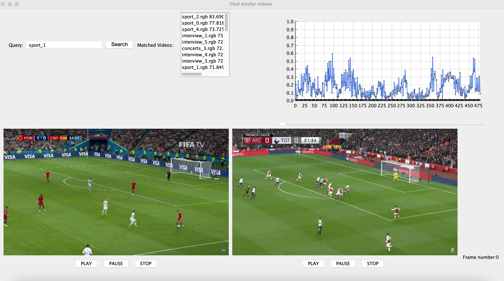

# Multimedia-descriptors-for-search
Extracting multimedia descriptors for a database of videos and perform a search for a given query on that database

The goal of the project is to create a search among videos that is similar to text-based searching. There is a database of short video clips, with each frame of dimensions 640x360. For each clip, only the first 480 frames are considered for analysis. For each of the clip in the database, audio, color and motion descriptors are extracted beforehand and stored in txt files. The descriptors are extracted as follows:

Color descriptor: For each frame of a clip, an HSV value of maximum frequency is extracted and stored.

Audio descriptor: The maximum amplitude is extracted.

Motion descriptor: Each frame of clip is divided into 16x16 blocks and a motion vector is obtained. The motion vectors of all blocks are averaged to obtain a single motion vector for each frame of the clip.

When a query is provided, the descriptors are extracted for the given video. These are compared against the descriptors of the clips in the database and a ranking of matched videos is obtained.

